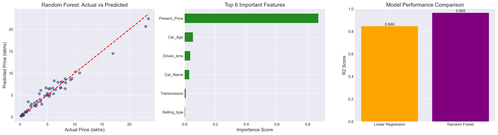

# CodeAlpha Task 3: Car Price Prediction with ML

## 📊 Project Overview
This project predicts used car selling prices using Machine Learning regression models. We compared Linear Regression vs Random Forest Regressor to find the best performing model.

This was completed as Task 3 for the CodeAlpha Machine Learning Internship.

## 🎯 Dataset
- **Source**: Car Price Dataset
- **Shape**: 301 rows, 9 columns
- **Features**: Car_Name, Year, Present_Price, Driven_kms, Fuel_Type, Selling_type, Transmission, Owner
- **Target Variable**: Selling_Price

## ⚙️ Tech Stack
- **Language**: Python 3.11
- **Libraries**: Pandas, NumPy, Scikit-learn, Matplotlib, Seaborn
- **IDE**: VS Code

## 🔬 Methodology
1. **Data Cleaning**: Checked for null values, handled missing data
2. **Feature Engineering**: Created `Car_Age` from `Year` column
3. **Encoding**: Used LabelEncoder for categorical variables
4. **Train-Test Split**: 80% training, 20% testing with random_state=42
5. **Model Training**: Linear Regression and Random Forest Regressor
6. **Evaluation**: Compared using R² Score, MAE, and RMSE

## 🤖 Model Results
| Model | R² Score | MAE (lakhs) | RMSE (lakhs) |
| --- | --- | --- | --- |
| Linear Regression | 0.846 | ~0.80 | ~1.20 |
| Random Forest | 0.965 | ~0.40 | ~0.80 |

**🏆 Best Model: Random Forest Regressor with 96.5% accuracy**

## 📈 Key Insights & Visualizations
1. `Present_Price` is the most important feature affecting resale value
2. `Car_Age` and `Driven_kms` have strong negative correlation with Selling_Price
3. Random Forest outperformed Linear Regression by 11.9%
4. Model predictions are highly accurate as shown in Actual vs Predicted plot



## 🚀 How to Run This Project
1. Clone the repository:
   ```bash
   git clone https://github.com/Siddhi2410586/CodeAlpha_CarPricePrediction.git
